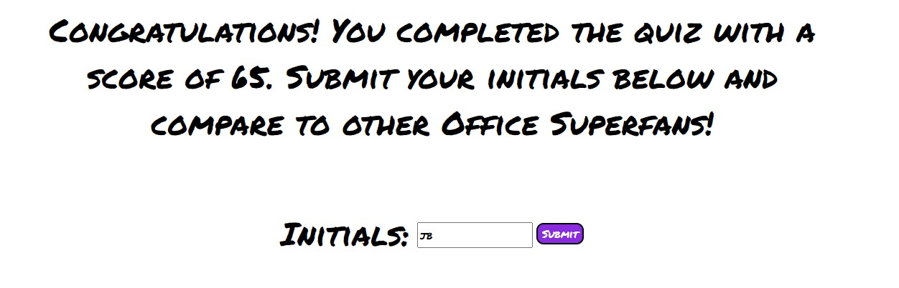
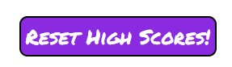
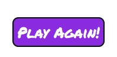
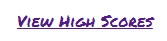

# It's Quiz Time!

## Description
Office Superfans are abundant, but quizes that truly test superfans' cability are few and far between. The [Office Superfan quiz](https://brigantinojoe.github.io/quiz/) will challenge your Office series knowledge and will save your scores to compete with other superfans! After watching the series over and over, I decided to create this quiz for others who have done the same. 

I learned quite a bit of Javascript this project including, but not limited to:
- Manipulating existing HTML elements. Specifically using the display style to hide and unhide certain elements.
- Adding Event Listeners for the various types of HTML buttons
- Using dynamic CSS to apply CSS to the new elements created in the Javascript functions.
- Using intervals to create timers that can be changed and saved as a final score.

## Installation
There is no installation necessary. Please visit [this website](https://brigantinojoe.github.io/quiz/) to start! 

## Usage
1. Go to [this website](https://brigantinojoe.github.io/quiz/) and click the "Start" button on the bottom of the page.
2. You'll have 75 seconds to complete the quiz.
3. Answer the questions to the best of your ability! There are four possible answers for each question.
    - Each incorrect answer will deduct 15 seconds from the running timer.
4. Your score will be the remaining time you have left after answering the last question. 
5. After you complete the quiz, or if the timer hits '0', you'll be directed to submit your score. Please type in your initials and click 'Submit' as shown below.
    
6. Once you click submit, you'll be directed to the "High Scores" page where you can compare your score to others. 
7. If you'd like to reset the high scores, click on the "Reset High Scores" button as shown below. 
    
8. Otherwise, you can click "Play Again" to start the quiz for a better score.

9. If, at any point, you want to view high scores without completing the quiz, click on the "View High Scores" link on the top left corner of your screen.

